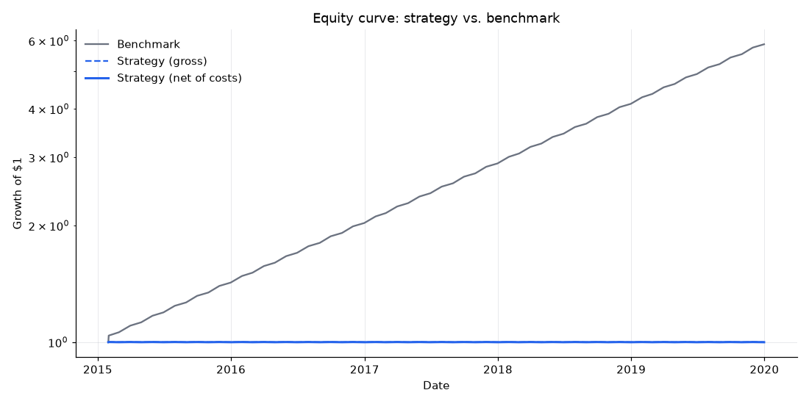
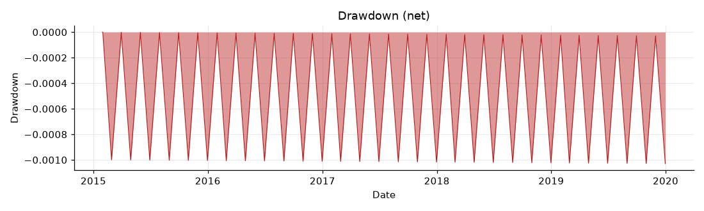
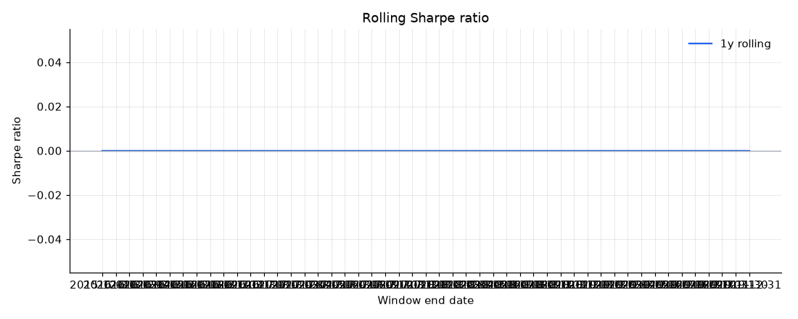
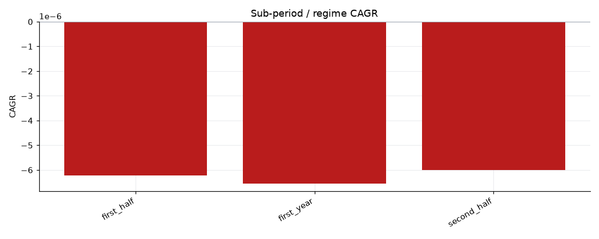
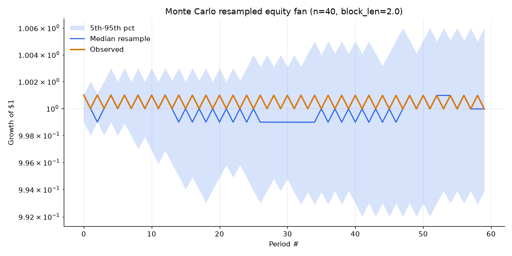
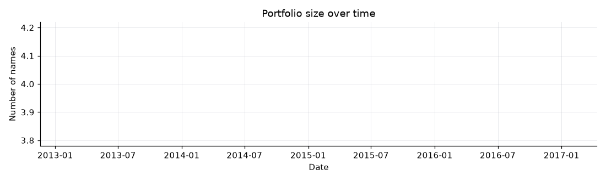

# QuantLab report - momentum-weak

**Verdict: REJECTED**
`momentum-weak` · data semantics `m03b` · run unknown · git `test-sha` · quantlab 0.1.0

net CAGR -0.00%, Sharpe 0.00, max drawdown -0.10% - verdict REJECTED.

_REJECTED: at least one HARD gate failed. RESEARCH_ONLY: every hard gate passed but at least one SOFT gate failed. ELIGIBLE_FOR_PAPER: every hard and soft gate passed. Hard-gate failures cap the verdict at REJECTED; soft-gate failures cap it at RESEARCH_ONLY; the informational notes beside min_psr and the Monte Carlo drawdown gate never affect the verdict at all. A verdict is not evidence of edge; it states which tests the result survived._

## Headline vs. benchmark
| Metric | Net | Gross | Note |
|---|---|---|---|
| CAGR | -0.00% | -0.00% |  |
| Annualized volatility (net) | 0.35% |  |  |
| Sharpe (net) | 0.00 |  |  |
| Sortino (net) | 0.00 |  | Sharpe: pandas ddof=1 (sample std), annualized by sqrt(periods_per_year). Sortino: target return 0, FULL-SAMPLE N at ddof=0 (not losing-periods-only N). The two denominators are on DIFFERENT footings (M05 carried item 8) - do not compare them via their raw values alone. |
| Max drawdown (net) | -0.10% |  |  |
| Calmar (net) | -0.01 |  |  |
| Hit rate | 50.00% |  |  |
| Mean turnover | 10.00% |  |  |
| Cost drag (CAGR impact) | 0.00% |  |  |
| Benchmark CAGR | 43.35% |  |  |
| Benchmark Sharpe | 10.31 |  |  |
beta 0.10  |  information ratio -11.45  |  tracking error 3.14%  (overlap: 60 periods)

## Trust panel

**Coverage bound: 0.00%** - worst sampled rebalance-date year, % of point-in-time members with no cached history or masked before that date; a ceiling on invisibility, not a return impact.

forced exits, extreme-return exclusions, unscored and dropped tickers are SEPARATE selection effects from the coverage bound above - they are not additive into one headline number (carried M04 verdict item 4).

coverage bound 0.0% (worst sampled year's uncached/masked universe fraction) - this bound and the unscored-ticker / dropped-ticker counts reported separately below are SEPARATE selection effects, not additive into one headline number

| | |
|---|---|
| Forced exits (delisting) | 0 |
| Extreme-return exclusions, long book | 0 |
| Extreme-return exclusions, short book | 0 |
| Rebalance dates with unscored names | 0 |
| Rebalance dates with data-availability drops | 0 |

this run's data_semantics_version (m03b) predates M04b: this count conflates names the strategy could not price with names it simply did not select into the book (measured on a real run: 173 dates, 467-476 names each against 30 holdings) - read it as a selection artefact, not a data-quality signal.
### Known caveats
- Purged/embargoed CV needs both a purge and an embargo because a contiguous test fold can sit in the MIDDLE of the series with training data on both sides, so a training row's own label window can overlap the test fold from either direction; the walk-forward check (validation/walk_forward.py) needs neither, because its weight choice is made from a STRICTLY PRIOR training block and applied only to the STRICTLY SUBSEQUENT, not-yet-realized test block - there is no way for the test block's own returns to leak backward into that choice.
- n_trials for this family may double-count the strategy's own headline run against a sensitivity grid's base point at the same parameters - the two use independent id schemes and the registry does not reconcile them (registry.py's module docstring). This over-counts N by one trial; unlike an earlier version of this note claimed, over-counting N is NOT generally conservative for DSR once var_sr_trials is estimated from the same trial set (quant-gate VERDICT.md M06 cycle-1 finding 1) - it is disclosed here because it is a small, one-trial effect, not because its direction is guaranteed safe.
- subperiod_oof_sharpe (mean Sharpe over contiguous sub-periods) is a consistency check on a FIXED-PARAMETER strategy, not a purged cross-validation: no model is refit per fold, so purge/embargo cannot change its value (quant-gate VERDICT.md M06 cycle-1 finding 4) - purged_kfold_splits itself remains correct and is kept for a future fitted strategy.
- at least one trial counted toward this family's N (or its dispersion estimate) was recorded from a dirty (uncommitted-changes) working tree - see the provenance section's dirty trial count.

## Validation badges
N trials (distinct): **1** (raw key count: 1, 1 dirty) · PSR 0.5000 · DSR n/a (registry too thin - fewer than 2 distinct trials) · min track-record length unbounded (n/a)

Reality Check: Reality Check did not run - see the reality_check_pvalue gate's own reason.

Hansen SPA: Hansen SPA did not run - see the spa_pvalue gate's own reason.

RC/SPA benchmark: embedded (result.benchmark_returns) - validation.yaml default · headline's own retained fraction: 100.00%

Monte Carlo: CAGR p5/p50/p95: -0.12% / -0.00% / 0.12%  |  Max drawdown p5/p50/p95: -1.00% / -0.50% / -0.29%  |  Sharpe p5/p50/p95: -0.35 / 0.00 / 0.35  |  observed max drawdown: -0.10% (40 resamples, block_len=2.0).

| Gate | Kind | Value | Threshold | Result | Reason |
|---|---|---|---|---|---|
| deflated_sharpe_ratio | hard | n/a (could not be computed) | 0.9500 | FAIL | DSR could not be computed - fewer than 2 distinct trials are registered for this family (N=1); this is the registry being too thin, NOT a statistical failure - treated as a FAILURE (not a pass) until more genuinely distinct trials are recorded. |
| reality_check_pvalue | hard | n/a (could not be computed) | 0.1000 | FAIL | Reality Check could not be run: fewer than 2 registered trials in this family have a stored return series - treated as a FAILURE, not a pass by default. |
| net_sharpe_vs_benchmark | hard | 0.0000 | 10.3053 | FAIL | net Sharpe 0.00 vs benchmark Sharpe 10.31. |
| coverage_bound | hard | 0.0000 | 15.0000 | PASS | worst-year coverage bound 0.0% against the 15.0% ceiling. |
| min_track_record_length | hard | unbounded (n/a) | 60.0000 | FAIL | needs >= inf observations for significance; 60 are available (computed on the PER-PERIOD Sharpe 0.0000, not the annualized 0.00). |
| probabilistic_sharpe_ratio | soft | 0.5000 | 0.9500 | FAIL | PSR=0.5000 against the 0.95 bar (computed on the PER-PERIOD Sharpe 0.0000, not the annualized 0.00). min_psr 0.95 binds only below an annualised Sharpe of about 0.47 on a 12-year monthly book - neither is evidence of quality. |
| subperiod_oof_sharpe | soft | 0.0000 | 0.0000 | FAIL | mean Sharpe 0.00 over 5 contiguous sub-periods of a strategy with NO FITTED PARAMETERS - purge/embargo have no effect on this value by construction (quant-gate VERDICT.md M06 cycle-1 finding 4); NOT a purged cross-validation. |
| no_cliff_score | soft | n/a (could not be computed) | 0.5000 | FAIL | no sensitivity grid was supplied - treated as a FAILURE, not a pass by default. |
| min_net_sharpe | soft | 0.0000 | 0.3000 | FAIL | net Sharpe 0.00 against 0.30 - gated ALONGSIDE no_cliff_score per the M05 carried item (a flat-but-bad neighbourhood must not pass on no_cliff_score alone). |
| max_drawdown_floor | soft | -0.0010 | -0.5000 | PASS | FULL-SAMPLE net max drawdown -0.10% against the -50.00% floor (never a rolling column - see max_negative_rolling_window_fraction below for that). |
| max_negative_rolling_window_fraction | soft | 0.5102 | 0.5000 | FAIL | 51% of rolling windows had negative CAGR against the 50% bar - computed from the FROZEN ported rolling_window_metrics table, whose CAGR is blind to each window's own first return (ported convention, see rolling.py's module docstring). |
| monte_carlo_drawdown | soft | 0.9750 | 0.5000 | FAIL | P(bootstrap drawdown worse than observed)=0.97. the Monte Carlo drawdown gate sits at the centre of its own statistic's null - neither is evidence of quality. |
| capacity_ceiling | soft | n/a (could not be computed) | 100.0000 | FAIL | no price panel was supplied - capacity was not estimated - treated as a FAILURE, not a pass by default. |
| spa_pvalue | soft | n/a (could not be computed) | 0.1000 | FAIL | SPA could not be run (fewer than 2 registered trials with a stored return series) - treated as a FAILURE, not a pass by default. |
| walk_forward_stability | soft | n/a (could not be computed) | 0.5000 | PASS | no walk-forward result was supplied - vacuously satisfied per 'if present'. |

## Robustness
### Rolling 1y window

ported convention: each window's first return is omitted from CAGR and hidden from drawdown (M05 carried item; frozen under CLAUDE.md invariant #4 - see validation/rolling.py's module docstring).
 Showing first/last 5 of 49 rows.
| Window end | CAGR | Vol | Sharpe | Max DD |
|---|---|---|---|---|
| 2015-12-31 | -0.11% | 0.36% | 0.00 | -0.10% |
| 2016-01-31 | 0.11% | 0.36% | 0.00 | -0.10% |
| 2016-02-29 | -0.11% | 0.36% | 0.00 | -0.10% |
| 2016-03-31 | 0.11% | 0.36% | 0.00 | -0.10% |
| 2016-04-30 | -0.11% | 0.36% | 0.00 | -0.10% |
| ... |  |  |  |  |
| 2019-08-31 | -0.11% | 0.36% | 0.00 | -0.10% |
| 2019-09-30 | 0.11% | 0.36% | 0.00 | -0.10% |
| 2019-10-31 | -0.11% | 0.36% | 0.00 | -0.10% |
| 2019-11-30 | 0.11% | 0.36% | 0.00 | -0.10% |
| 2019-12-31 | -0.11% | 0.36% | 0.00 | -0.10% |

### Sub-period / regime table

| Period | CAGR | Vol | Sharpe | Max DD | Growth |
|---|---|---|---|---|---|
| first_half | -0.00% | 0.35% | 0.00 | -0.10% | 1.0000 |
| first_year | -0.00% | 0.36% | 0.00 | -0.10% | 1.0000 |
| second_half | -0.00% | 0.35% | 0.00 | -0.10% | 1.0000 |

### Monte Carlo resample

### Portfolio size

### Flags
- benchmark Sharpe exceeds strategy Sharpe
- 51% of rolling 1y windows negative (by CAGR)

## Execution conventions

| | |
|---|---|
| Execution mode | n/a - execution mode not recorded in the backtest_config for this run. |
| Cost model | n/a (not recorded in the backtest_config for this run) (n/a (not recorded in the backtest_config for this run) bps one-way) |
| Borrow fee (annual) | n/a (not recorded in the backtest_config for this run) bps |
| Corwin-Schultz lookback | n/a (not recorded in the backtest_config for this run) days |
| Delisting haircut | n/a (not recorded in the backtest_config for this run) |
| Extreme-return policy | n/a (not recorded in the backtest_config for this run) (bound n/a (not recorded in the backtest_config for this run)x) |
| Filing lag | n/a (strategy has no filing-lag parameter) session(s) |
| Max dropped fraction (abort threshold) | n/a (not recorded in the backtest_config for this run) |
| Abort on unscoreable date | n/a (not recorded in the backtest_config for this run) |

## Provenance appendix

| | |
|---|---|
| Strategy id | `momentum-weak` |
| Strategy params | `{}` |
| Backtest config | `{'end': '2019-12-31', 'initial_capital': 1000000.0, 'rebalance_freq': 'month_end', 'start': '2015-01-31'}` |
| Providers | `{}` |
| Actions-cache fetched_at range | n/a - n/a |
| Cache dir | n/a (not recorded in this run's provenance) |
| Run seconds | n/a (not recorded) |
| Quarantined tickers | 0 |
| Masked-start tickers | 0 |
| quantlab version | 0.1.0 |