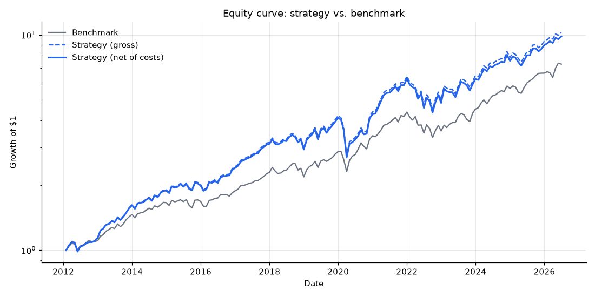
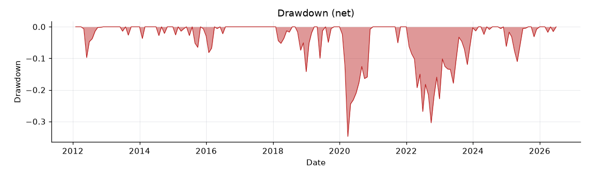
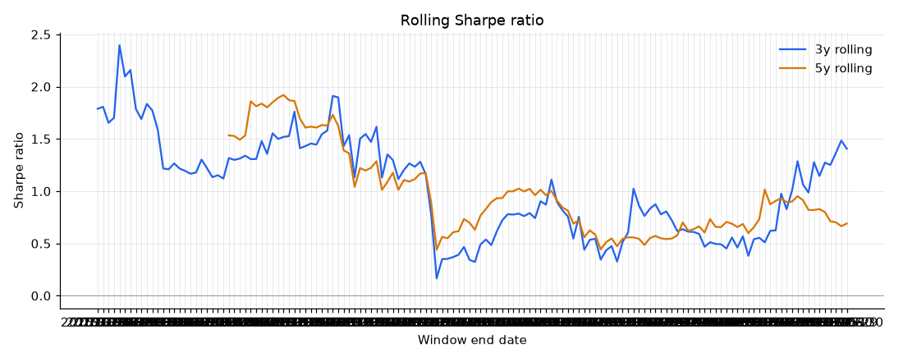
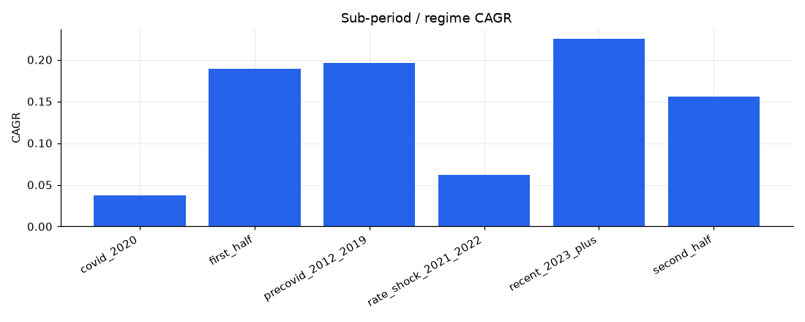
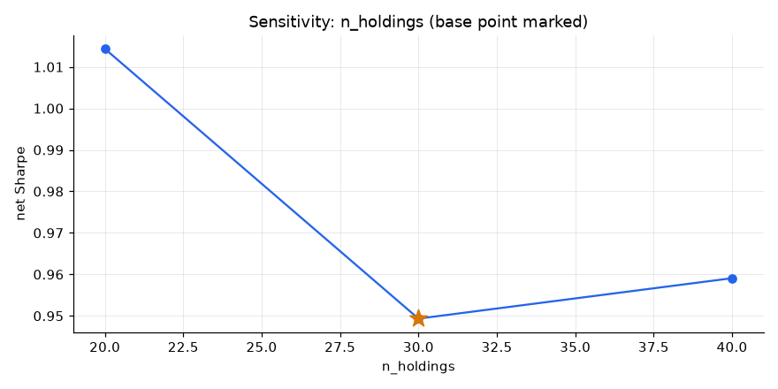
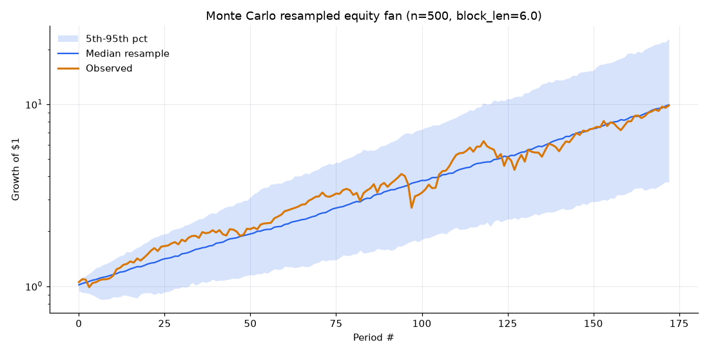
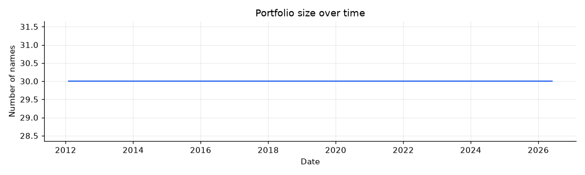

# QuantLab report - value_composite-b6fdfec048

**Verdict: REJECTED**
`value_composite-b6fdfec048` · data semantics `m09` · run 2026-10-01T15:36:59.163929+00:00 · git `dc5356d7c0fa02929ea4d8d1c6144083dbdcae70` · quantlab 0.1.0

net CAGR 17.19%, Sharpe 0.95, max drawdown -34.75% - verdict REJECTED.

_REJECTED: at least one HARD gate failed. RESEARCH_ONLY: every hard gate passed but at least one SOFT gate failed. ELIGIBLE_FOR_PAPER: every hard and soft gate passed. Hard-gate failures cap the verdict at REJECTED; soft-gate failures cap it at RESEARCH_ONLY; gates of kind INFORMATIONAL (capacity, at Alex's retail stake - orchestrator decision, plans/QUANT-NOTES.md) and the informational notes beside min_psr and the Monte Carlo drawdown gate are always reported but never affect the verdict at all. A verdict is not evidence of edge; it states which tests the result survived._

## Headline vs. benchmark
| Metric | Net | Gross | Note |
|---|---|---|---|
| CAGR | 17.19% | 17.53% |  |
| Annualized volatility (net) | 18.68% |  |  |
| Sharpe (net) | 0.95 |  |  |
| Sortino (net) | 1.50 |  | Sharpe: pandas ddof=1 (sample std), annualized by sqrt(periods_per_year). Sortino: target return 0, FULL-SAMPLE N at ddof=0 (not losing-periods-only N). The two denominators are on DIFFERENT footings (M05 carried item 8) - do not compare them via their raw values alone. |
| Max drawdown (net) | -34.75% |  |  |
| Calmar (net) | 0.49 |  |  |
| Hit rate | 67.63% |  |  |
| Mean turnover | 12.18% |  |  |
| Cost drag (CAGR impact) | 0.34% |  |  |
| Benchmark CAGR | 14.81% |  |  |
| Benchmark Sharpe | 1.06 |  |  |
beta 1.19  |  information ratio 0.33  |  tracking error 8.75%  (overlap: 173 periods)

## Trust panel

**Coverage bound: 28.37%** - worst sampled rebalance-date year, % of point-in-time members with no cached history or masked before that date; a ceiling on invisibility, not a return impact.

forced exits, extreme-return exclusions, unscored and dropped tickers are SEPARATE selection effects from the coverage bound above - they are not additive into one headline number (carried M04 verdict item 4).

coverage bound 28.4% (worst sampled year's uncached/masked universe fraction) - this bound and the unscored-ticker / dropped-ticker counts reported separately below are SEPARATE selection effects, not additive into one headline number

| | |
|---|---|
| Forced exits (delisting) | 0 |
| Extreme-return exclusions, long book | 0 |
| Extreme-return exclusions, short book | 0 |
| Rebalance dates with unscored names | 173 |
| Rebalance dates with data-availability drops | 0 |

this run's data_semantics_version (m09) is at or after M04b: this count is strategy-self-reported and genuinely means 'could not be scored'.
### Known caveats
- TTM EPS is restated PER-COMPONENT (M09, data/pit.py's fundamentals() restatement using data/providers/edgar_fundamentals.py's ttm_eps_components): a split falling BETWEEN two component filings no longer leaves the sum in mixed share terms (closing plans/QUANT-NOTES.md 'From M03b verdict' item 1 - was bounded to the P/E leg, adverse direction, up to 2.5x on the gate's own straddling-split fixture). A narrower residual remains when a fundamentals provider supplies no per-component data at all (falls back to the pre-M09 single-filed-date restatement) or a filer's own reporting convention does not follow the modelled quarter/annual duration windows; treat any value/blend result touching ttm_eps with this narrower caveat in mind.
- Yahoo symbol reuse erases delisted history; 36 historical constituent(s) in this run's tracked universe were quarantined because their cached price series belongs to a DIFFERENT, later company now trading under the same symbol (data/quality.py's scan_price_cache) - see provenance.quarantined_tickers.
- 168 ticker(s) in this run's tracked universe have NEVER been visited by `quantlab data scan` - their quarantine status is unknown, not confirmed-clean; run `quantlab data scan` before trusting the quarantined count above as complete. See provenance.never_scanned_tickers.
- 168 ticker(s) in this run's tracked universe are currently suppressed by an ACTIVE negative-cache 'no_data' sidecar (TTL 30 days) - the same config run again after the TTL lapses could see a DIFFERENT set of tickers. See provenance.retry_after_days and provenance.no_data_suppressed_tickers.
- Purged/embargoed CV needs both a purge and an embargo because a contiguous test fold can sit in the MIDDLE of the series with training data on both sides, so a training row's own label window can overlap the test fold from either direction; the walk-forward check (validation/walk_forward.py) needs neither, because its weight choice is made from a STRICTLY PRIOR training block and applied only to the STRICTLY SUBSEQUENT, not-yet-realized test block - there is no way for the test block's own returns to leak backward into that choice.
- n_trials for this family may double-count the strategy's own headline run against a sensitivity grid's base point at the same parameters - the two use independent id schemes and the registry does not reconcile them (registry.py's module docstring). This over-counts N by one trial; unlike an earlier version of this note claimed, over-counting N is NOT generally conservative for DSR once var_sr_trials is estimated from the same trial set (quant-gate VERDICT.md M06 cycle-1 finding 1) - it is disclosed here because it is a small, one-trial effect, not because its direction is guaranteed safe.
- subperiod_oof_sharpe (mean Sharpe over contiguous sub-periods) is a consistency check on a FIXED-PARAMETER strategy, not a purged cross-validation: no model is refit per fold, so purge/embargo cannot change its value (quant-gate VERDICT.md M06 cycle-1 finding 4) - purged_kfold_splits itself remains correct and is kept for a future fitted strategy.
- at least one trial counted toward this family's N (or its dispersion estimate) was recorded from a dirty (uncommitted-changes) working tree - see the provenance section's dirty trial count.

## Validation badges
N trials (distinct): **3** (raw key count: 4, 3 dirty) · PSR 0.9992 · DSR 0.9917 · min track-record length unbounded (n/a)

Reality Check: K=4 realised trials over n_periods=173 common periods, B=200 bootstrap resamples, block_len=6.0. measured size ≈ 0.12 at the 0.10 bar (block length 6.0); treat the bar as approximate.

Hansen SPA: K=4 realised trials over n_periods=173 common periods, B=200 bootstrap resamples, block_len=6.0. measured size ≈ 0.12 at the 0.10 bar (block length 6.0); treat the bar as approximate.

RC/SPA benchmark: embedded (result.benchmark_returns) - validation.yaml default · headline's own retained fraction: 100.00%

Monte Carlo: CAGR p5/p50/p95: 9.56% / 17.26% / 24.25%  |  Max drawdown p5/p50/p95: -47.10% / -34.75% / -14.96%  |  Sharpe p5/p50/p95: 0.53 / 0.97 / 1.43  |  observed max drawdown: -34.75% (500 resamples, block_len=6.0).

Capacity: spread percentiles: p10=5.5bps, p25=11.5bps, p50=18.9bps, p75=24.6bps, p90=29.2bps, p99=39.9bps  |  AUM ceiling range: $92,965,329 - $266,760,498 across 4 liquidity assumption(s), 207 ticker(s). For scale only, NOT the output of this run: the old repo capacity estimate on real 2012-2026 S&P 500 data was $95,000,000-$335,000,000 AUM, under an assumed 50-name book (1/50 position_frac).

| Gate | Kind | Value | Threshold | Result | Reason |
|---|---|---|---|---|---|
| deflated_sharpe_ratio | hard | 0.9917 | 0.9500 | PASS | DSR=0.9917 against the 0.95 bar for significance after correcting for N=3 distinct trials (computed on the PER-PERIOD Sharpe 0.2740, not the annualized 0.95 - see deflated_sharpe.py's 'same footing' contract). DSR is not monotone in N above the variance floor; near-duplicate reruns of one grid point can move it. |
| reality_check_pvalue | hard | 0.0149 | 0.1000 | PASS | White Reality Check p=0.0149 against the 0.10 bar, over K=4 realised trials, benchmark=embedded (result.benchmark_returns) - validation.yaml default. |
| net_sharpe_vs_benchmark | hard | 0.9493 | 1.0583 | FAIL | net Sharpe 0.95 vs benchmark Sharpe 1.06. |
| coverage_bound | hard | 28.3702 | 15.0000 | FAIL | worst-year coverage bound 28.4% against the 15.0% ceiling. |
| min_track_record_length | hard | unbounded (n/a) | 173.0000 | FAIL | needs >= unbounded observations for significance; 173 are available (computed on the PER-PERIOD Sharpe 0.2740, not the annualized 0.95). |
| probabilistic_sharpe_ratio | soft | 0.9992 | 0.9500 | PASS | PSR=0.9992 against the 0.95 bar (computed on the PER-PERIOD Sharpe 0.2740, not the annualized 0.95). min_psr 0.95 binds only below an annualised Sharpe of about 0.47 on a 12-year monthly book - neither is evidence of quality. |
| subperiod_oof_sharpe | soft | 1.1847 | 0.0000 | PASS | mean Sharpe 1.18 over 5 contiguous sub-periods of a strategy with NO FITTED PARAMETERS - purge/embargo have no effect on this value by construction (quant-gate VERDICT.md M06 cycle-1 finding 4); NOT a purged cross-validation. |
| no_cliff_score | soft | 0.9322 | 0.5000 | PASS | no_cliff_score=0.9322 against 0.50 (neighbourhood_size=3, neighbourhood_truncated=False, nan_points=0) - a RELATIVE-SPREAD statistic only, never evidence of quality by itself (see min_net_sharpe below). |
| min_net_sharpe | soft | 0.9493 | 0.3000 | PASS | net Sharpe 0.95 against 0.30 - gated ALONGSIDE no_cliff_score per the M05 carried item (a flat-but-bad neighbourhood must not pass on no_cliff_score alone). Sensitivity grid: (neighbourhood_size=3, neighbourhood_truncated=False, nan_points=0). |
| max_drawdown_floor | soft | -0.3475 | -0.5000 | PASS | FULL-SAMPLE net max drawdown -34.75% against the -50.00% floor (never a rolling column - see max_negative_rolling_window_fraction below for that). |
| max_negative_rolling_window_fraction | soft | 0.0000 | 0.5000 | PASS | 0% of rolling windows had negative CAGR against the 50% bar - computed from the FROZEN ported rolling_window_metrics table, whose CAGR is blind to each window's own first return (ported convention, see rolling.py's module docstring). |
| monte_carlo_drawdown | soft | 0.3260 | 0.5000 | PASS | P(bootstrap drawdown worse than observed)=0.33. the Monte Carlo drawdown gate sits at the centre of its own statistic's null - neither is evidence of quality. |
| spa_pvalue | soft | 0.0199 | 0.1000 | PASS | Hansen SPA p=0.0199 against the 0.10 bar, over K=4 realised trials, benchmark=embedded (result.benchmark_returns) - validation.yaml default. |
| walk_forward_stability | soft | n/a (could not be computed) | 0.5000 | PASS | no walk-forward result was supplied - vacuously satisfied per 'if present'. |
| capacity_ceiling | informational | 92965.3294 | 100.0000 | PASS | worst-case capacity ceiling is 92965x the resolved intended capital ($1,000, configs/validation.yaml intended_capital_usd) against the 100x bar. NOTE: the capacity gate is trivially passable at this stake (92965x against a 100x bar) - this is not evidence of edge, only that the resolved intended capital is small relative to the instrument's liquidity. |
`informational` gates are always reported (value, threshold, result) but never affect the verdict above - see the verdict legend.

## Robustness
### Rolling 3y window

ported convention: each window's first return is omitted from CAGR and hidden from drawdown (M05 carried item; frozen under CLAUDE.md invariant #4 - see validation/rolling.py's module docstring).
 Showing first/last 5 of 138 rows.
| Window end | CAGR | Vol | Sharpe | Max DD |
|---|---|---|---|---|
| 2015-01-30 | 21.16% | 11.88% | 1.79 | -9.75% |
| 2015-02-27 | 22.66% | 12.17% | 1.81 | -9.75% |
| 2015-03-31 | 22.33% | 12.25% | 1.65 | -9.15% |
| 2015-04-30 | 26.80% | 12.19% | 1.70 | -3.70% |
| 2015-05-29 | 25.71% | 10.35% | 2.40 | -3.70% |
| ... |  |  |  |  |
| 2026-02-27 | 20.53% | 14.94% | 1.27 | -11.02% |
| 2026-03-31 | 19.77% | 15.00% | 1.25 | -11.02% |
| 2026-04-30 | 24.31% | 15.14% | 1.36 | -11.02% |
| 2026-05-29 | 20.09% | 14.73% | 1.48 | -11.02% |
| 2026-06-30 | 18.10% | 14.12% | 1.41 | -11.02% |
### Rolling 5y window

ported convention: each window's first return is omitted from CAGR and hidden from drawdown (M05 carried item; frozen under CLAUDE.md invariant #4 - see validation/rolling.py's module docstring).
 Showing first/last 5 of 114 rows.
| Window end | CAGR | Vol | Sharpe | Max DD |
|---|---|---|---|---|
| 2017-01-31 | 18.90% | 12.36% | 1.53 | -9.75% |
| 2017-02-28 | 19.10% | 12.32% | 1.53 | -9.75% |
| 2017-03-31 | 19.58% | 12.28% | 1.49 | -9.15% |
| 2017-04-28 | 22.36% | 12.24% | 1.53 | -8.17% |
| 2017-05-31 | 21.32% | 11.23% | 1.86 | -8.17% |
| ... |  |  |  |  |
| 2026-02-27 | 13.90% | 20.64% | 0.80 | -30.43% |
| 2026-03-31 | 11.99% | 20.46% | 0.71 | -30.43% |
| 2026-04-30 | 12.73% | 20.41% | 0.70 | -30.43% |
| 2026-05-29 | 12.33% | 20.44% | 0.66 | -30.43% |
| 2026-06-30 | 12.37% | 20.45% | 0.69 | -30.43% |

### Sub-period / regime table

| Period | CAGR | Vol | Sharpe | Max DD | Growth |
|---|---|---|---|---|---|
| covid_2020 | 3.70% | 39.62% | 0.29 | -34.75% | 1.0371 |
| first_half | 18.89% | 12.57% | 1.45 | -14.23% | 3.4494 |
| precovid_2012_2019 | 19.63% | 13.39% | 1.41 | -14.23% | 4.1318 |
| rate_shock_2021_2022 | 6.22% | 25.13% | 0.36 | -30.43% | 1.1279 |
| recent_2023_plus | 22.52% | 16.46% | 1.32 | -11.02% | 2.0355 |
| second_half | 15.54% | 23.27% | 0.74 | -34.75% | 2.8522 |

### Parameter sensitivity

no_cliff_score = **0.9322** (neighbourhood_size=3, neighbourhood_truncated=False, nan_points=0) - shown ONLY beside min_net_sharpe below.

no_cliff_score=0.9322 against 0.50 (neighbourhood_size=3, neighbourhood_truncated=False, nan_points=0) - a RELATIVE-SPREAD statistic only, never evidence of quality by itself (see min_net_sharpe below).

net Sharpe 0.95 against 0.30 - gated ALONGSIDE no_cliff_score per the M05 carried item (a flat-but-bad neighbourhood must not pass on no_cliff_score alone). Sensitivity grid: (neighbourhood_size=3, neighbourhood_truncated=False, nan_points=0).

Base point: **n_holdings=30**

| Grid point | Net Sharpe |
|---|---|
| n_holdings=20 | 1.01 |
| n_holdings=30 (base point) | 0.95 |
| n_holdings=40 | 0.96 |

### Monte Carlo resample

### Portfolio size

### Flags
- 173 rebalance date(s) had declared-universe tickers left unscored (unpriceable) and dropped from weights
- benchmark Sharpe exceeds strategy Sharpe

## Execution conventions

| | |
|---|---|
| Execution mode | close - close = same-session close (the decision date's own close price). |
| Cost model | flat_bps (10.0 bps one-way) |
| Borrow fee (annual) | 30.0 bps |
| Corwin-Schultz lookback | 60 days |
| Delisting haircut | 0.00% |
| Extreme-return policy | exclude_legacy (bound 3.00x) |
| Filing lag | 1 session(s) |
| Max dropped fraction (abort threshold) | 5.00% |
| Abort on unscoreable date | True |

## Provenance appendix

| | |
|---|---|
| Strategy id | `value_composite-b6fdfec048` |
| Strategy params | `{'filing_lag_sessions': 1, 'n_holdings': 30}` |
| Backtest config | `{'abort_on_unscoreable': True, 'benchmark': 'SPY', 'borrow_fee_annual_bps': 30.0, 'corwin_schultz_lookback_days': 60, 'cost_model': 'flat_bps', 'delisting_haircut': 0.0, 'end': '2026-06-30T00:00:00', 'execution': 'close', 'extreme_return_bound': 3.0, 'extreme_return_policy': 'exclude_legacy', 'initial_capital': 1000000.0, 'max_dropped_fraction': 0.05, 'one_way_cost_bps': 10.0, 'rebalance_freq': 'month_end', 'start': '2012-01-01T00:00:00', 'strategy_config': 'C:\\Users\\arwga\\Developer\\ClaudeProjects\\Trading\\quantlab\\configs\\strategies\\value_composite.yaml'}` |
| Providers | `{'constituents': 'SP500CommunityConstituentsProvider', 'corporate_actions': 'YFinanceCorporateActionsProvider', 'fundamentals': 'EdgarFundamentalsProvider', 'prices': 'YFinancePriceProvider'}` |
| Actions-cache fetched_at range | 2026-09-13 - 2026-09-13 |
| Cache dir | n/a (not recorded in the provenance for this run) |
| Run seconds | 23373.25 |
| Quarantined tickers | 36 |
| Masked-start tickers | 0 |
| quantlab version | 0.1.0 |